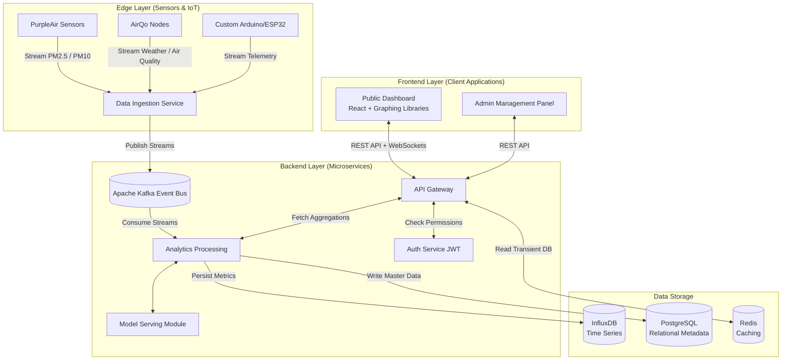
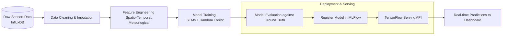
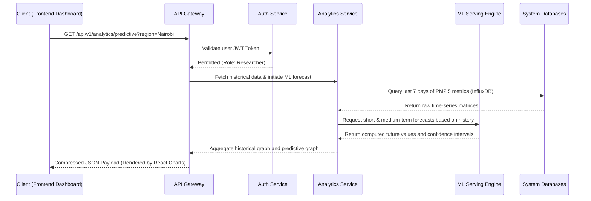

# AQMRG AI Analytics Platform

> Comprehensive Methodology, Architecture, and Developer Documentation

---

## Part 1: Research Methodology & Expected Results (Proposal Guide)

This section provides an in-depth breakdown of the research methodology, architectural framework, data pipeline, and expected results for the AQMRG AI Analytics Platform. This comprehensive documentation maps the entire flow from Edge Sensors, through the Backend Infrastructure, to the Frontend Interface.

### 1. Introduction
The AQMRG AI Analytics Platform is an advanced, microservices-based infrastructure designed to ingest, process, and analyze heterogeneous sensor data regarding air quality. By merging high-throughput data processing with predictive machine learning (ML), the platform delivers robust real-time tracking, predictive modeling, and data-driven insights to facilitate proactive public health and environmental decisions.

### 2. Comprehensive System Architecture

The ecosystem relies on three distinct layers: the **Edge Layer** (data generation), the **Backend Services Layer** (processing and storage), and the **Frontend Layer** (visualization and interaction).

- **Frontend Client (React/Vite)**: Delivers interactive geographic maps, historical data charts, and real-time dashboard elements to end-users. It communicates exclusively with the API Gateway.
- **Backend Microservices**: A containerized architecture orchestrated by Kubernetes. Services operate independently, communicating asynchronously to prevent latency ceilings.
- **Data Stores**: Segregated databases specifically chosen for distinct data typologies (Time-series vs. Relational vs. Cache).

#### High-Level Architecture Flowchart



### 3. Data Ingestion & Processing Methodology

The platform must handle highly irregular and volatile data streams generated by remote environmental sensors. The methodology follows a robust ETL (Extract, Transform, Load) model:

1. **Extraction**: Devices push payloads (often JSON or MQTT messages) to the `Data Ingestion Service`. 
2. **Buffering & Queueing**: Raw signals are pushed to **Apache Kafka**. Kafka decouples the incoming data speed from the processing speed, providing crash fault-tolerance.
3. **Filtering & Pre-processing**: Stream processors filter out incomplete data packets, applying calibration algorithms to adjust raw readings based on humidity or sensor degradation.
4. **Storage Strategy**:
  - *Time-Series Data*: Validated sensor entries are written into **InfluxDB**, optimized for temporal queries (e.g., "average PM2.5 over the last 15 minutes grouped by 1-minute intervals").
  - *Relational Data*: **PostgreSQL** handles user accounts, sensor geographical coordinates, and static configuration rules.

### 4. Machine Learning & Predictive Methodology

The intelligence of the platform resides in its forecasting and anomaly detection capabilities, structured into an automated ML pipeline.

#### Machine Learning Pipeline Flowchart



- **Predictive Analytics (Forecasting)**:
  - *Algorithm Selection*: Deployment of Long Short-Term Memory (LSTM) recurrent neural networks, ensembled alongside tree-based methodologies (XGBoost) for highly accurate 4-hour, 24-hour, and 72-hour air quality index forecasting.
  - *Spatio-Temporal Modeling*: Features are deeply engineered, capturing both local climatic conditions (temperature, humidity, wind velocity) and historical pollutant concentrations ($PM_{2.5}$, $PM_{10}$, $NO_2$, $O_3$).
- **Data Quality & Anomaly Detection**: 
  - Utilizing unsupervised learning constructs like Isolation Forests to autonomously flag anomalous sensor jumps, identifying hardware failures prior to manual audit.
  - Apache Airflow orchestrates daily data pipelines, evaluating model drift against incoming ground-truth values and initiating retraining algorithms if accuracy thresholds fall.

### 5. Client Interaction & Request Flow Methodology

How does a user seamlessly view advanced analytics? Data retrieval is governed by an asynchronous API gateway methodology. Below illustrates the sequence when a dashboard component requests predictive charting tools for a specific geographical region.

#### User Interaction Sequence Diagram



### 6. Expected Results & Performance Targets

By combining aggressive microservice decoupling with robust mathematical modeling, this framework aims to achieve the following performance constraints:

#### 6.1. Analytical & Scientific Outcomes
- **Predictive Fidelity**: Target a Mean Absolute Percentage Error (MAPE) of strictly $\leq 15\%$ for 24-hour $PM_{2.5}$ pollutant forecasting, actively outperforming standard baseline persistence methodologies.
- **Anomaly Detection Optimization**: Isolate hardware malfunctions and environmental spikes with an F1-score exceeding $0.85$, structurally minimizing false-positive alert fatigue for network administrators.
- **Multimodal Data Integration**: Seamlessly unify distinct environmental datasets (e.g., satellite imagery proxy readings alongside ground-level particulate telemetry) into a harmonized spatio-temporal index.

#### 6.2. System Architecture Metrics
- **Real-Time Responsiveness**: Ensure end-to-end latency remains beneath 30 seconds from physical sensor transmission edge-points to the graphical rendering on the frontend dashboard.
- **Systematic Throughput**: Guarantee horizontal ingestion scaling capability to safely accommodate 10,000+ concurrent continuous sensor stream readings per minute.
- **Platform Availability**: Maintain rigorous redundancy mechanisms through Kubernetes replication to achieve $99.9\%$ uptime for critical public-access APIs.

---

## Part 2: Project Structure & Developer Guide

### Project Structure (Monorepo)

```text
.
├── frontend/                    # User interface (React, Vite)
├── services/                    # Backend Microservices
│   ├── api-gateway/            # Central entry point and routing
│   ├── auth-service/           # JWT, RBAC, access management
│   ├── data-ingestion/         # Streaming processors
│   ├── analytics-service/      # Aggregations, API handlers
│   └── model-serving/          # TF-Serving inference execution
│
├── ml/                         # Machine Learning Environment
│   ├── training/               # Jupyter/Python scripts for LSTM
│   ├── feature-engineering/    # Data transformation pipelines
│   └── registry/               # MLFlow definitions
│
├── data-pipeline/              # Kafka, stream configurations, Airflow DAGs
├── infrastructure/             # K8s manifest files, Terraform, Docker
├── databases/                  # Prisma/Sequelize configurations, SQL scripts
└── docs/                       # Architectural diagrams & operational manuals
```

### Local Development Setup

#### Prerequisites
- Docker Desktop & Docker Compose
- Node.js v18+ & Python 3.10+
- Terraform (If building infrastructure locally)

#### Quick Start
1. **Repository Setup**:
   ```bash
   git clone https://github.com/affrentice/aqmrg-api.git
   cd aqmrg-api
   cp .env.example .env
   ```
2. **Container Spin-Up**:
   ```bash
   docker-compose up -d
   ```
3. **Database Preparation**:
   ```bash
   make migrate
   make seed
   ```

**Service Ports**:
- Frontend UI: `http://localhost:5173`
- API Gateway: `http://localhost:8000`
- MLFlow Dashboard: `http://localhost:5000`
- Grafana Metrics: `http://localhost:3000`

### Adding a New Microservice Layer
1. Scaffold inside `./services/` leveraging standard templates.
2. Define the routing index within `api-gateway`.
3. Add the associated container blocks within `docker-compose.yml`.
4. Run integration tests suite locally:
   ```bash
   make test-integration
   ```

### Documentation & Maintenance
For deeper insights into infrastructure, navigate to `/docs/architecture`. The project follows CI/CD deployments directly integrated with GitHub Actions pushing to established staging and production Kubernetes pods.

---
**Maintained by**: AQMRG Development & Research Team
**License**: MIT License
